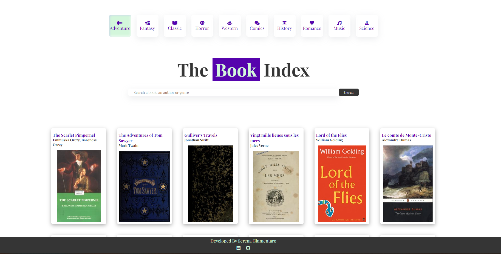
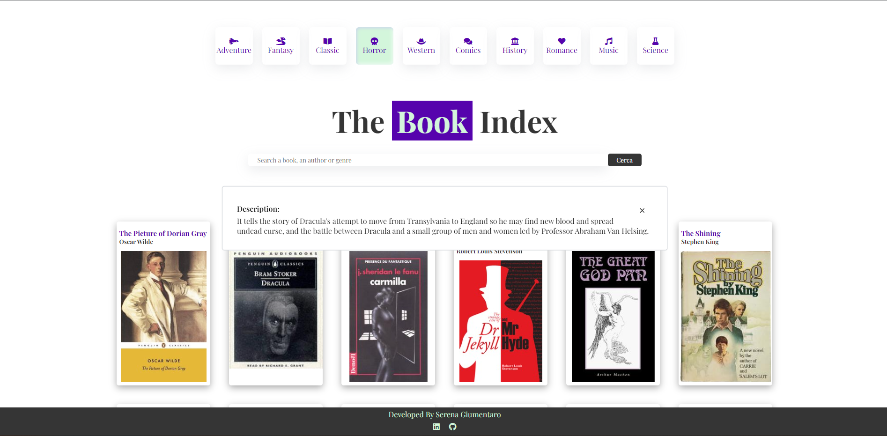
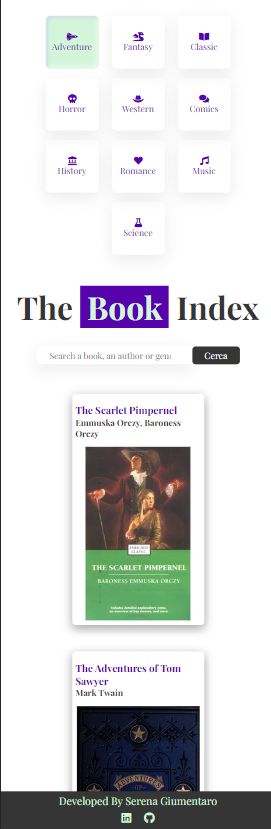

# Javascritp-Advanced-Project
Progetto del modulo Javascript Advanced per Start2impact University

### Table of contents

- [About the project](#about-the-project)
  - [Built with](#built-with)
- [Usage](#usage)
- [Responsive](#responsive)
- [Contact](#contact)

### About the project

This is the project for the module `Javascript Advanced` from `Start2Impact University`.

The app's target is to encorauge to reading more books, and does it using the `Open Library API`. 

#### Built with

This project is built with:
- HTML
- CSS
- Javascript
- Webpack
- Axios
- Npm

### Usage

The app is very intuitive to use. 
You can search a subject in the search-box and click on the search-button or press the Enter key and you will get a list of books about that subject. 
If you are very lazy, there are pre-made categories ready just for you.

For every book you can click on it for having additional description.

### Responsive

You can use this app on several devices.

#### Mobile device

## Contact

Giumentaro Serena https://www.linkedin.com/in/serenagiumentaro/

Project Link https://the-book-index.netlify.app/

